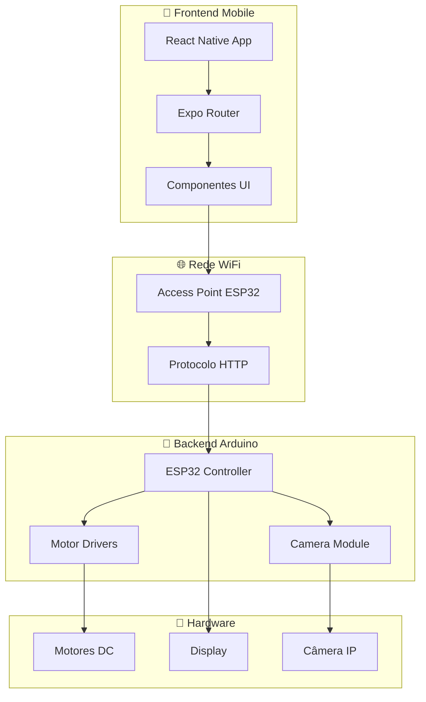

# 🚗 UOLI - Sistema de Controle de Carrinho Inteligente

<div align="center">


**Sistema completo de controle remoto para carrinho inteligente via WiFi**

[📱 App Mobile](#-app-mobile) • [🤖 Arduino ESP32](#-arduino-esp32) • [🌐 Rede](#-configuração-de-rede) • [📚 Documentação](#-documentação)

</div>

---

## 🎯 Visão Geral

O **UOLI** é um sistema completo de controle remoto para carrinho inteligente, desenvolvido com tecnologias modernas para oferecer uma experiência de controle intuitiva e responsiva.

### ✨ Características Principais:
- 🎮 **Controle Intuitivo**: Interface touch com botões direcionais
- 📹 **Streaming de Vídeo**: Visualização em tempo real da câmera
- 🌐 **Comunicação WiFi**: Controle sem fio via rede local

---

## 🏗️ Arquitetura do Sistema



---

## 📱 App Mobile

### Tecnologias Utilizadas:
- **React Native** 0.81.4
- **Expo** ~54.0.13
- **TypeScript** 5.9.2
- **Expo Router** ~6.0.11

### Componentes Principais:
- **ActionBar**: Barra de controles e mensagens
- **CameraDisplay**: Streaming de vídeo em tempo real
- **ControlButtons**: Botões direcionais de movimento
- **CarControlService**: Serviço de comunicação com Arduino

### Interface:
- 🎨 **Design System**: Paleta de cores personalizada
- 📱 **Responsivo**: Otimizado para landscape
- 🌙 **Dark Mode**: Interface escura moderna

---

## 🤖 Arduino ESP32

### Hardware Necessário:
- **ESP32 DevKit** (WiFi + Bluetooth)
- **ESP32-CAM** (Câmera + Streaming)
- **Driver L298N** (Controle de Motores)
- **2x Motores DC** (12V, 200-300 RPM)
- **LEDs** (5V, para iluminação)
- **Bateria 12V** (Para motores)

### Funcionalidades:
- 🌐 **Access Point**: Cria rede WiFi "UOLI_CAR"
- 📡 **Servidor HTTP**: API REST para controle
- 📹 **Streaming**: Vídeo MJPEG em tempo real
- 🎮 **Controle de Motores**: Movimento direcional

---

## 🌐 Configuração de Rede

### Parâmetros de Rede:
- **SSID**: `UOLI_CAR`
- **Senha**: `12345678`
- **IP do ESP32**: `192.168.4.1`
- **Porta HTTP**: `80`
- **Porta da Câmera**: `81`

### Protocolo de Comunicação:
```http
GET /action?go=F    # Frente
GET /action?go=B    # Trás
GET /action?go=L    # Esquerda
GET /action?go=R    # Direita
GET /action?go=S    # Parar
GET /action?go=l    # Toggle Luz
GET /action?go=m{msg} # Enviar Mensagem
```

---

## 🚀 Instalação e Configuração

### 1. **Pré-requisitos**
```bash
# Node.js (v18+)
# npm ou yarn
# Expo CLI
npm install -g @expo/cli

# Arduino IDE
# ESP32 Board Package
```

### 2. **Instalação do App**
```bash
# Clonar repositório
git clone https://github.com/joaoneves11/uoli.git
cd uoli-expo

# Instalar dependências
npm install

# Iniciar projeto
npm start
```

### 3. **Configuração do Arduino**
1. Instalar ESP32 no Arduino IDE
2. Carregar código do ESP32
3. Configurar hardware

### 4. **Teste da Integração**
1. Conectar ao WiFi "UOLI_CAR"
2. Abrir app UOLI
3. Testar controles
4. Verificar stream de vídeo

---
