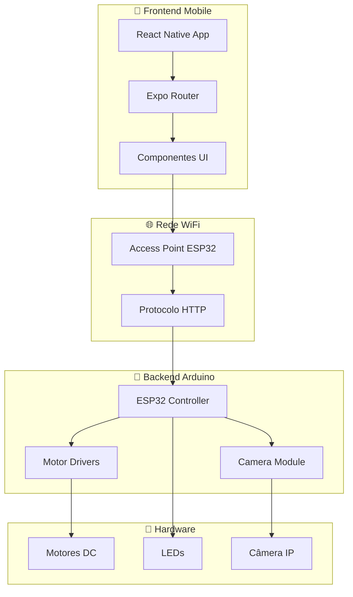

# 🚗 UOLI - Sistema de Controle de Carrinho Inteligente

<div align="center">


**Sistema completo de controle remoto para carrinho inteligente via WiFi**

[📱 App Mobile](#-app-mobile) • [🤖 Arduino ESP32](#-arduino-esp32) • [🌐 Rede](#-configuração-de-rede) • [📚 Documentação](#-documentação)

</div>

---

## 🎯 Visão Geral

O **UOLI** é um sistema completo de controle remoto para carrinho inteligente, desenvolvido com tecnologias modernas para oferecer uma experiência de controle intuitiva e responsiva.

### ✨ Características Principais:
- 🎮 **Controle Intuitivo**: Interface touch com botões direcionais
- 📹 **Streaming de Vídeo**: Visualização em tempo real da câmera
- 💡 **Sistema de Iluminação**: Controle de LEDs integrado
- 📱 **App Responsivo**: Interface otimizada para landscape
- 🌐 **Comunicação WiFi**: Controle sem fio via rede local
- 🔧 **Arquitetura Modular**: Fácil manutenção e expansão

---

## 🏗️ Arquitetura do Sistema



---

## 📱 App Mobile

### Tecnologias Utilizadas:
- **React Native** 0.81.4
- **Expo** ~54.0.13
- **TypeScript** 5.9.2
- **Expo Router** ~6.0.11

### Componentes Principais:
- **ActionBar**: Barra de controles e mensagens
- **CameraDisplay**: Streaming de vídeo em tempo real
- **ControlButtons**: Botões direcionais de movimento
- **CarControlService**: Serviço de comunicação com Arduino

### Interface:
- 🎨 **Design System**: Paleta de cores personalizada
- 📱 **Responsivo**: Otimizado para landscape
- 🌙 **Dark Mode**: Interface escura moderna
- ⚡ **Performance**: Animações suaves e responsivas

---

## 🤖 Arduino ESP32

### Hardware Necessário:
- **ESP32 DevKit** (WiFi + Bluetooth)
- **ESP32-CAM** (Câmera + Streaming)
- **Driver L298N** (Controle de Motores)
- **2x Motores DC** (12V, 200-300 RPM)
- **LEDs** (5V, para iluminação)
- **Bateria 12V** (Para motores)

### Funcionalidades:
- 🌐 **Access Point**: Cria rede WiFi "UOLI_CAR"
- 📡 **Servidor HTTP**: API REST para controle
- 📹 **Streaming**: Vídeo MJPEG em tempo real
- 🎮 **Controle de Motores**: Movimento direcional
- 💡 **Sistema de Luzes**: Controle de LEDs

---

## 🌐 Configuração de Rede

### Parâmetros de Rede:
- **SSID**: `UOLI_CAR`
- **Senha**: `12345678`
- **IP do ESP32**: `192.168.4.1`
- **Porta HTTP**: `80`
- **Porta da Câmera**: `81`

### Protocolo de Comunicação:
```http
GET /action?go=F    # Frente
GET /action?go=B    # Trás
GET /action?go=L    # Esquerda
GET /action?go=R    # Direita
GET /action?go=S    # Parar
GET /action?go=l    # Toggle Luz
GET /action?go=m{msg} # Enviar Mensagem
```

---

## 🚀 Instalação e Configuração

### 1. **Pré-requisitos**
```bash
# Node.js (v18+)
# npm ou yarn
# Expo CLI
npm install -g @expo/cli

# Arduino IDE
# ESP32 Board Package
```

### 2. **Instalação do App**
```bash
# Clonar repositório
git clone <repository-url>
cd uoli-expo

# Instalar dependências
npm install

# Iniciar projeto
npm start
```

### 3. **Configuração do Arduino**
1. Instalar ESP32 no Arduino IDE
2. Carregar código do ESP32
3. Configurar hardware
4. Testar conectividade

### 4. **Teste da Integração**
1. Conectar ao WiFi "UOLI_CAR"
2. Abrir app UOLI
3. Testar controles
4. Verificar stream de vídeo

---

## 📚 Documentação

### 📖 Documentação Técnica Completa:

| Documento | Descrição | Link |
|-----------|-----------|------|
| **📋 Documentação Principal** | Arquitetura, componentes e integração | [DOCUMENTACAO_TECNICA.md](./DOCUMENTACAO_TECNICA.md) |
| **🤖 Código Arduino** | Implementação completa do ESP32 | [ARDUINO_ESP32_CODE.md](./ARDUINO_ESP32_CODE.md) |
| **🌐 Configuração de Rede** | Setup de rede e troubleshooting | [NETWORK_SETUP.md](./NETWORK_SETUP.md) |

### 🔧 Guias Rápidos:

#### **Para Desenvolvedores**:
- [Estrutura do Projeto](#-estrutura-do-projeto)
- [Componentes React Native](#-componentes-principais)
- [API de Comunicação](#-protocolo-de-comunicação)

#### **Para Hardware**:
- [Lista de Componentes](#-hardware-necessário)
- [Conexões do Circuito](#-conexões)
- [Configuração do ESP32](#-configuração-do-arduino)

#### **Para Troubleshooting**:
- [Problemas de Rede](#-troubleshooting-de-rede)
- [Erros do App](#-problemas-comuns)
- [Debug do Arduino](#-logs-de-debug)

---

## 🛠️ Scripts Disponíveis

```bash
# Desenvolvimento
npm start                 # Iniciar Expo
npm run android          # Android
npm run ios              # iOS
npm run web              # Web

# Debug
npx expo start --clear   # Limpar cache
npx expo doctor          # Verificar configuração
```

---

## 🎮 Como Usar

### 1. **Preparação**:
1. Ligar o ESP32 (carrinho)
2. Conectar ao WiFi "UOLI_CAR"
3. Abrir app UOLI

### 2. **Controle Básico**:
- **Frente**: Botão ↑
- **Trás**: Botão ↓
- **Esquerda**: Botão ←
- **Direita**: Botão →
- **Parar**: Soltar botão

### 3. **Funcionalidades Avançadas**:
- **Luz**: Toggle no ActionBar
- **Câmera**: Visualização automática
- **Mensagens**: Input de texto
- **Screenshot**: Captura de tela (em desenvolvimento)

---

## 🔧 Troubleshooting

### **Problemas Comuns**:

#### **App não conecta**:
```bash
# Verificar rede
ping 192.168.4.1

# Testar API
curl http://192.168.4.1/test
```

#### **Câmera não carrega**:
- Verificar URL: `http://192.168.4.1:81/stream`
- Verificar configuração da câmera
- Testar no navegador

#### **Controles não respondem**:
- Verificar logs do ESP32
- Verificar conexões dos motores
- Testar com ferramentas HTTP

---

## 🚀 Roadmap

### **Versão Atual (1.0.0)**:
- ✅ Controle básico de movimento
- ✅ Sistema de luzes
- ✅ Streaming de vídeo
- ✅ Interface responsiva

### **Próximas Versões**:
- 🔄 Screenshot funcional
- 📊 Telemetria avançada
- 🎯 Controle de velocidade
- 📱 Múltiplos carrinhos
- 🔒 Autenticação de segurança

---

## 🤝 Contribuição

### **Como Contribuir**:
1. Fork do repositório
2. Criar branch para feature
3. Implementar mudanças
4. Testar integração
5. Submeter pull request

### **Áreas de Contribuição**:
- 🐛 Bug fixes
- ✨ Novas funcionalidades
- 📚 Documentação
- 🧪 Testes
- 🎨 UI/UX

---

## 📄 Licença

Este projeto está sob a licença MIT. Veja o arquivo [LICENSE](LICENSE) para mais detalhes.

---

## 📞 Suporte

### **Canais de Suporte**:
- 📧 Email: suporte@uoli.com
- 💬 Issues: [GitHub Issues](https://github.com/uoli/issues)
- 📚 Documentação: [Wiki do Projeto](https://github.com/uoli/wiki)

### **Recursos Úteis**:
- 🔧 [Expo Documentation](https://docs.expo.dev/)
- 🤖 [ESP32 Documentation](https://docs.espressif.com/)
- 📱 [React Native Guide](https://reactnative.dev/docs/getting-started)

---

<div align="center">

**Desenvolvido com ❤️ para controle inteligente de carrinhos**


</div>
