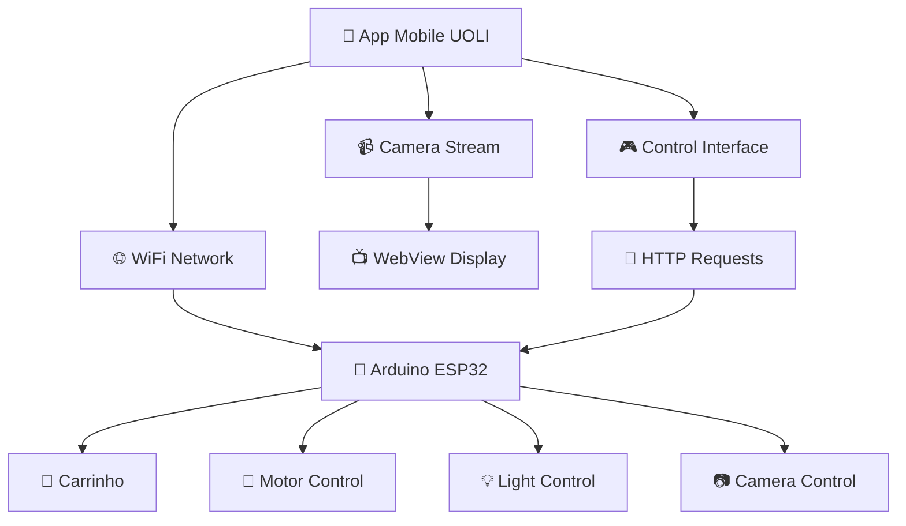

# 📱 UOLI - Documentação Técnica
## Sistema de Controle de Carrinho Inteligente

---

## 📋 Índice
1. [Visão Geral](#visão-geral)
2. [Arquitetura do Sistema](#arquitetura-do-sistema)
3. [Estrutura do Projeto](#estrutura-do-projeto)
4. [Componentes Principais](#componentes-principais)
5. [Integração com Arduino ESP](#integração-com-arduino-esp)
6. [Configuração e Instalação](#configuração-e-instalação)
7. [Protocolo de Comunicação](#protocolo-de-comunicação)
8. [Troubleshooting](#troubleshooting)

---

## 🎯 Visão Geral

O **UOLI** é um sistema de controle remoto para carrinho inteligente desenvolvido com React Native/Expo. O projeto permite controlar um veículo via WiFi através de uma interface mobile intuitiva, incluindo streaming de vídeo em tempo real.

### Características Principais:
- ✅ Controle de movimento (frente, trás, esquerda, direita)
- ✅ Sistema de luzes
- ✅ Streaming de vídeo em tempo real
- ✅ Envio de mensagens
- ✅ Interface responsiva em landscape
- ✅ Comunicação WiFi com Arduino ESP

---

## 🏗️ Arquitetura do Sistema



### Componentes do Sistema:
1. **Frontend Mobile** (React Native/Expo)
2. **Backend Arduino** (ESP32)
3. **Câmera IP** (Streaming)
4. **Hardware do Carrinho** (Motores, LEDs, etc.)

---

## 📁 Estrutura do Projeto

```
uoli-expo/
├── 📱 app/                          # Expo Router Pages
│   ├── (tabs)/                      # Tab Navigation
│   │   ├── index.tsx               # Tela Principal (Controle)
│   │   ├── two.tsx                 # Tela Secundária
│   │   └── _layout.tsx             # Layout das Tabs
│   ├── _layout.tsx                 # Layout Principal
│   ├── modal.tsx                   # Modal Screen
│   └── +not-found.tsx             # 404 Page
├── 🧩 components/                   # Componentes Reutilizáveis
│   ├── ActionBar.tsx               # Barra de Ações
│   ├── CameraDisplay.tsx           # Display da Câmera
│   ├── ControlButtons.tsx          # Botões de Controle
│   ├── Themed.tsx                  # Componentes Temáticos
│   └── ...
├── 🎨 constants/                    # Constantes
│   └── Colors.ts                   # Paleta de Cores
├── 🔧 services/                     # Serviços
│   └── carControlService.ts        # Serviço de Controle
├── 📦 assets/                       # Recursos
└── 📄 Configurações
    ├── app.json                    # Configuração Expo
    ├── package.json               # Dependências
    └── tsconfig.json              # TypeScript Config
```

---

## 🧩 Componentes Principais

### 1. **ActionBar** (`components/ActionBar.tsx`)
**Função**: Barra superior com controles e input de mensagem

```typescript
interface ActionBarProps {
  message: string;
  onMessageChange: (text: string) => void;
  onSendMessage: () => void;
  onToggleCamera: () => void;
  onToggleLight: () => void;
  onScreenshot: () => void;
  isCameraClosed: boolean;
  isLightOn: boolean;
}
```

**Recursos**:
- Input de mensagem com botão de envio
- Toggle de câmera (abrir/fechar)
- Toggle de luz
- Botão de screenshot

### 2. **CameraDisplay** (`components/CameraDisplay.tsx`)
**Função**: Exibição do stream de vídeo da câmera

```typescript
interface CameraDisplayProps {
  cameraClosed: boolean;
}
```

**Recursos**:
- WebView para streaming de vídeo
- URL: `http://192.168.4.1:81/stream`
- Loading states e error handling
- Animações de fade

### 3. **ControlButtons** (`components/ControlButtons.tsx`)
**Função**: Botões de controle de movimento

```typescript
interface ControlButtonsProps {
  onForward: () => void;
  onBack: () => void;
  onLeft: () => void;
  onRight: () => void;
  onStop: () => void;
}
```

**Layout**:
```
    ↑ (Frente)
← (Esquerda) → (Direita)
    ↓ (Trás)
```

### 4. **CarControlService** (`services/carControlService.ts`)
**Função**: Serviço de comunicação com Arduino

```typescript
export class CarControlService {
  baseUrl: string = "http://192.168.4.1";
  
  async goForward()    // F
  async goBack()       // B
  async goLeft()       // L
  async goRight()      // R
  async stop()         // S
  async toggleLight()  // l
  async sendMessage()  // m{message}
}
```

---

## 🔌 Integração com Arduino ESP

### Hardware Necessário:
- **ESP32** (WiFi + Bluetooth)
- **Motores DC** (2x para movimento)
- **Driver de Motor** (L298N ou similar)
- **Câmera IP** (ESP32-CAM ou similar)
- **LEDs** (para iluminação)
- **Bateria** (12V para motores, 5V para ESP32)

### Código Arduino (Exemplo):

```cpp
#include <WiFi.h>
#include <WebServer.h>
#include <ESP32Camera.h>

// Configuração WiFi
const char* ssid = "UOLI_CAR";
const char* password = "12345678";

WebServer server(80);
ESP32Camera camera;

// Pinos dos motores
#define MOTOR_A1 2
#define MOTOR_A2 4
#define MOTOR_B1 16
#define MOTOR_B2 17
#define LIGHT_PIN 5

void setup() {
  Serial.begin(115200);
  
  // Configurar WiFi AP
  WiFi.softAP(ssid, password);
  IPAddress IP = WiFi.softAPIP();
  Serial.print("AP IP address: ");
  Serial.println(IP);
  
  // Configurar câmera
  camera.init(esp32cam_aithinker_config);
  
  // Configurar servidor
  server.on("/action", handleAction);
  server.on("/stream", handleStream);
  server.begin();
}

void handleAction() {
  String action = server.arg("go");
  
  if (action == "F") {
    goForward();
  } else if (action == "B") {
    goBack();
  } else if (action == "L") {
    goLeft();
  } else if (action == "R") {
    goRight();
  } else if (action == "S") {
    stop();
  } else if (action == "l") {
    toggleLight();
  } else if (action.startsWith("m")) {
    String message = action.substring(1);
    handleMessage(message);
  }
  
  server.send(200, "text/plain", "OK");
}

void goForward() {
  digitalWrite(MOTOR_A1, HIGH);
  digitalWrite(MOTOR_A2, LOW);
  digitalWrite(MOTOR_B1, HIGH);
  digitalWrite(MOTOR_B2, LOW);
}

void goBack() {
  digitalWrite(MOTOR_A1, LOW);
  digitalWrite(MOTOR_A2, HIGH);
  digitalWrite(MOTOR_B1, LOW);
  digitalWrite(MOTOR_B2, HIGH);
}

void goLeft() {
  digitalWrite(MOTOR_A1, LOW);
  digitalWrite(MOTOR_A2, HIGH);
  digitalWrite(MOTOR_B1, HIGH);
  digitalWrite(MOTOR_B2, LOW);
}

void goRight() {
  digitalWrite(MOTOR_A1, HIGH);
  digitalWrite(MOTOR_A2, LOW);
  digitalWrite(MOTOR_B1, LOW);
  digitalWrite(MOTOR_B2, HIGH);
}

void stop() {
  digitalWrite(MOTOR_A1, LOW);
  digitalWrite(MOTOR_A2, LOW);
  digitalWrite(MOTOR_B1, LOW);
  digitalWrite(MOTOR_B2, LOW);
}

void toggleLight() {
  digitalWrite(LIGHT_PIN, !digitalRead(LIGHT_PIN));
}

void handleMessage(String message) {
  Serial.println("Mensagem recebida: " + message);
  // Implementar lógica da mensagem
}
```

---

## ⚙️ Configuração e Instalação

### 1. **Pré-requisitos**
```bash
# Node.js (v18+)
# npm ou yarn
# Expo CLI
npm install -g @expo/cli
```

### 2. **Instalação do Projeto**
```bash
# Clonar repositório
git clone <repository-url>
cd uoli-expo

# Instalar dependências
npm install

# Iniciar projeto
npm start
```

### 3. **Configuração do Arduino**
1. Instalar ESP32 no Arduino IDE
2. Carregar código do ESP32
3. Configurar rede WiFi
4. Conectar hardware

### 4. **Configuração da Rede**
- **SSID**: `UOLI_CAR`
- **Password**: `12345678`
- **IP do ESP32**: `192.168.4.1`
- **Porta da Câmera**: `81`

---

## 📡 Protocolo de Comunicação

### Endpoints da API:

| Endpoint | Método | Parâmetro | Ação |
|----------|--------|-----------|------|
| `/action?go=F` | GET | F | Frente |
| `/action?go=B` | GET | B | Trás |
| `/action?go=L` | GET | L | Esquerda |
| `/action?go=R` | GET | R | Direita |
| `/action?go=S` | GET | S | Parar |
| `/action?go=l` | GET | l | Toggle Luz |
| `/action?go=m{msg}` | GET | m{msg} | Enviar Mensagem |
| `/stream` | GET | - | Stream de Vídeo |

### Exemplo de Requisição:
```javascript
// Frente
GET http://192.168.4.1/action?go=F

// Enviar mensagem
GET http://192.168.4.1/action?go=mHello World
```

---

## 🎨 Design System

### Paleta de Cores:
```typescript
const Colors = {
  main: "#8969FB",      // Roxo principal
  black: "#1B1B1D",     // Preto
  white: "#FFFFFF",     // Branco
  light: {
    text: '#11181C',
    background: '#fff',
    tint: '#8969FB',
    // ...
  },
  dark: {
    text: '#ECEDEE',
    background: '#1B1B1D',
    tint: '#8969FB',
    // ...
  }
};
```

### Layout:
- **Orientação**: Landscape
- **Tema**: Dark mode
- **Componentes**: Material Design inspired

---

## 🚀 Scripts Disponíveis

```json
{
  "scripts": {
    "start": "expo start",
    "android": "expo start --android",
    "ios": "expo start --ios",
    "web": "expo start --web"
  }
}
```

### Comandos Úteis:
```bash
# Desenvolvimento
npm start

# Android
npm run android

# iOS
npm run ios

# Web
npm run web

# Limpar cache
npx expo start --clear
```

---

## 🔧 Troubleshooting

### Problemas Comuns:

#### 1. **Erro de Conexão**
```
Error: Network request failed
```
**Solução**: Verificar se o ESP32 está conectado e a rede WiFi está ativa.

#### 2. **Câmera não carrega**
```
Camera stream not loading
```
**Solução**: Verificar URL da câmera e configuração do ESP32-CAM.

#### 3. **Controles não respondem**
```
Controls not working
```
**Solução**: Verificar se o Arduino está recebendo as requisições HTTP.

#### 4. **App não inicia**
```
Metro bundler errors
```
**Solução**: 
```bash
npx expo start --clear
rm -rf node_modules
npm install
```

### Logs de Debug:
```javascript
// No CarControlService
console.log("FRENTE"); // Verificar se está sendo chamado

// No Arduino
Serial.println("Comando recebido: " + action);
```

---

## 📱 Funcionalidades Implementadas

### ✅ **Funcionando**:
- Controle de movimento
- Toggle de luz
- Interface responsiva
- Navegação entre tabs
- Sistema de cores
- Envio de mensagens

### 🚧 **Em Desenvolvimento**:
- Screenshot (temporariamente desabilitado)
- Melhorias na UI
- Otimizações de performance

### 📋 **Planejado**:
- Gravação de vídeo
- Histórico de comandos
- Configurações avançadas
- Múltiplos carrinhos

---

## 📞 Suporte

Para dúvidas ou problemas:
1. Verificar logs do console
2. Testar conectividade de rede
3. Verificar configuração do Arduino
4. Consultar documentação do Expo

---

**Versão**: 1.0.0  
**Última Atualização**: Janeiro 2025  
**Desenvolvido com**: React Native, Expo, TypeScript, Arduino ESP32
